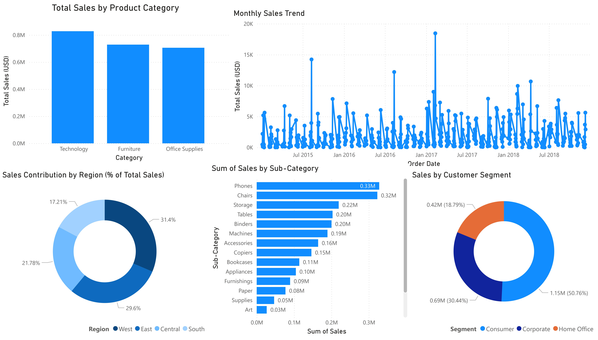

# Task 02: Data Visualization and Storytelling

**Role:** Data Analyst Intern  
**Project:** Superstore Sales Analysis  
**Tool:** Power BI (Web)

---

## Project Overview

This project was completed as part of a Data Analyst Internship and focuses on applying data visualization and storytelling principles to retail sales data. The objective is to convert raw transactional data into structured, meaningful, and business-relevant insights using professional dashboard design practices.

The analysis emphasizes clarity, accuracy, and decision-oriented storytelling aligned with industry standards.

---

## Business Objective

The primary objectives of this task are to:

- Analyze historical sales performance and trends  
- Identify key revenue drivers across products, regions, and customer segments  
- Communicate insights clearly to non-technical stakeholders  
- Demonstrate industry-standard data visualization practices  

---

## Tools and Technologies

| Tool | Purpose |
|-----|--------|
| Power BI (Web) | Dashboard design and visual analytics |
| CSV Dataset | Source data (Superstore Sales) |
| Markdown & PDF | Documentation and reporting |

---

## Dataset Description

The analysis uses the **Superstore Sales Dataset**, which contains transactional retail data with the following dimensions:

- **Time:** Order Date, Ship Date  
- **Product:** Category and Sub-Category  
- **Geography:** United States Regions (West, East, Central, South)  
- **Customer:** Consumer, Corporate, Home Office  
- **Metric:** Sales Amount  

This dataset supports multi-dimensional analysis across time, products, geography, and customer segments.

---

## Dashboard Preview

Below is the final Power BI dashboard created for this task:

<p align="center">
  
</p>

---

## Visualizations Included

The dashboard consists of the following visual components:

1. **Total Sales by Product Category**  
   - High-level comparison of revenue across major product categories  

2. **Monthly Sales Trend**  
   - Time-series analysis to identify trends and seasonality  

3. **Sales Contribution by Region**  
   - Percentage contribution of each U.S. region to total sales  

4. **Sales by Product Sub-Category**  
   - Detailed breakdown of top-performing and low-performing products  

5. **Sales by Customer Segment**  
   - Revenue distribution across Consumer, Corporate, and Home Office segments  

Each visualization was selected based on the business question it addresses and designed to minimize visual clutter while maximizing interpretability.

---

## Key Business Insights

- Technology is the highest revenue-generating product category.  
- The West and East regions together contribute more than half of total sales.  
- Monthly sales show noticeable seasonal fluctuations with periodic spikes.  
- Phones and Chairs are the top-performing product sub-categories.  
- The Consumer segment contributes the largest share of overall revenue.  

---

## Deliverables

| Deliverable | Location |
|------------|---------|
| Dashboard Screenshot | `dashboards/screenshots/superstore_dashboard.jpg` |
| Final Project Report (PDF) | `reports/Task-02_Data-Visualization-and-Storytelling.pdf` |
| Visual Insights Notes | `notes/visual_insights.md` |
| Dataset | `data/Superstore.csv` |

---

## Repository Structure

```text
Task-02_Data-Visualization-and-Storytelling
├── dashboards
│   └── screenshots
│       └── superstore_dashboard.jpg
├── data
│   └── Superstore.csv
├── notes
│   └── visual_insights.md
├── reports
│   └── Task-02_Data-Visualization-and-Storytelling.pdf
└── README.md
````

---

## Outcome

This project demonstrates the ability to transform raw data into structured, insight-driven visual stories using Power BI. It reflects an industry-aligned approach to analytical thinking, dashboard design, and professional documentation suitable for stakeholder and recruiter review.

---

## Author

**Athar Shaikh**  
Data Analyst Intern  
Elevate Labs  