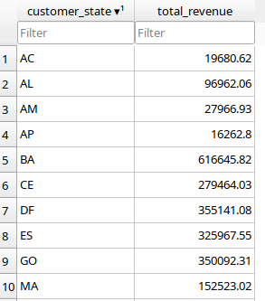
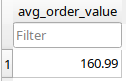

# Task 03 : SQL for Data Analysis

**End-to-End SQL Analytics Using SQLite**

<p align="center">
  <a href="https://www.sqlite.org/index.html">
    
  </a>
  <a href="https://www.kaggle.com/datasets/olistbr/brazilian-ecommerce">
    
  </a>
  <a href="https://github.com/atharmshaikh">
    
  </a>
</p>

---

## Overview

This repository contains **Task-03: SQL for Data Analysis**, completed using a **real-world e-commerce dataset** and an **industry-aligned SQL workflow**.

The goal of this task is **not just writing SQL queries**, but demonstrating the full analytical process:

* Designing an analytical schema
* Ingesting raw data safely
* Validating data integrity
* Performing business-focused SQL analysis
* Producing reproducible, verifiable results

The analysis is implemented using **SQLite**, a lightweight and widely used database for analytics, prototyping, and interviews.

---

## Dataset

**Name:** Brazilian E-Commerce Public Dataset by Olist
**Source:** Kaggle
**Link:**
[https://www.kaggle.com/datasets/olistbr/brazilian-ecommerce](https://www.kaggle.com/datasets/olistbr/brazilian-ecommerce)

**Description:**
The dataset contains real transactional data from a Brazilian e-commerce platform, including customers, orders, payments, timestamps, and geographic information.

> Raw CSV files are intentionally **not committed** to this repository.
> Only the processed analytical database is version-controlled.

---

## Tools & Technologies

| Category          | Tool                  |
| ----------------- | --------------------- |
| Database          | SQLite                |
| SQL Client        | DB Browser for SQLite |
| Operating Systems | Windows, Linux, macOS |
| Version Control   | Git & GitHub          |

---

## Project Structure

```text
Task-03_SQL-Analysis/
├── data/
│   ├── olist.db
│   ├── raw/
│   │   └── README.md
│   ├── processed/
│   │   └── README.md
│   └── README.md
├── sql/
│   ├── schema/
│   │   └── schema.sql
│   ├── queries/
│   │   └── aggregations.sql
│   └── analysis/
│       └── insights.sql
├── reports/
│   ├── screenshots/
│   │   ├── revenue_by_state.png
│   │   ├── avg_order_value.png
│   │   └── monthly_revenue.png
│   └── README.md
└── README.md
```

---

## Workflow Summary

The following **industry-standard workflow** was followed:

### 1. Raw Data Handling

* Dataset downloaded locally from Kaggle
* Raw CSV files kept **outside GitHub**
* Prevents large files, duplication, and licensing issues

### 2. Database Creation

* SQLite database created: `data/olist.db`
* Used as the single analytical data store

### 3. Schema Design

Final analytical tables:

* `customers`
* `orders`
* `order_payments`

Schema definition is available in:

```
sql/schema/schema.sql
```

### 4. Data Ingestion (Staging Pattern)

Instead of direct imports, a **staging approach** was used:

```
CSV → *_raw tables → final tables
```

This ensures:

* Controlled column selection
* Easier debugging
* Correct referential integrity

### 5. Data Validation

* Row count verification
* Join validation between tables
* Debugging mismatched imports
* Ensured valid relationships:

  * customers ↔ orders
  * orders ↔ order_payments

### 6. SQL Analysis

Business-focused SQL queries were written to answer real analytical questions.

All analysis queries are available in:

```
sql/analysis/insights.sql
```

---

## Analysis & Results

### Revenue by State

Identifies top revenue-contributing geographic regions.

[View full image](reports/screenshots/revenue_by_state.png)



---

### Average Order Value (AOV)

Measures the average revenue generated per order.

[View full image](reports/screenshots/avg_order_value.png)



---

### Monthly Revenue Trend

Shows revenue aggregated by month to analyze growth and seasonality.

[View full image](reports/screenshots/monthly_revenue.png)


---

## How to Run This Project

### Prerequisites (All Platforms)

* SQLite
* DB Browser for SQLite

---

### Windows

1. Download DB Browser for SQLite
   [https://sqlitebrowser.org/dl/](https://sqlitebrowser.org/dl/)
2. Open the application
3. Open the database file:

   ```
   data/olist.db
   ```
4. Run queries from:

   ```
   sql/analysis/insights.sql
   ```

---

### Linux (Ubuntu / Mint / Debian)

```bash
sudo apt install sqlitebrowser
```

Then:

1. Open **DB Browser for SQLite**
2. Load `data/olist.db`
3. Execute analysis queries

---

### macOS

```bash
brew install --cask db-browser-for-sqlite
```

Then:

1. Open the database file
2. Run SQL queries from `sql/analysis/insights.sql`

---

## Reproducibility

* Raw data can be re-downloaded from Kaggle
* Schema and SQL queries are fully version-controlled
* Screenshots provide execution proof
* Database can be rebuilt using documented steps

---

## Key Takeaways

This project demonstrates:

* Practical SQL for analytics
* Real dataset handling
* Debugging real data issues
* Clean repository organization
* Industry-aligned documentation

---

## Author

**Athar Shaikh** 
Data Analyst Intern 
Elevate Labs 