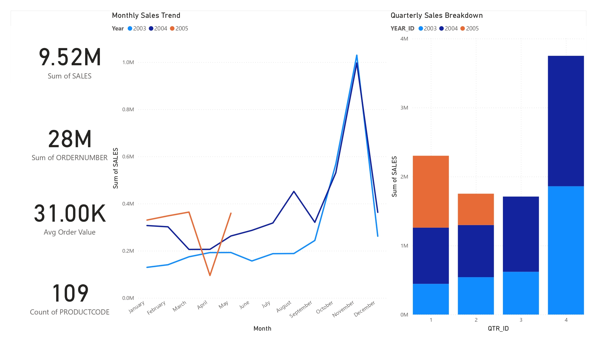

# Task 04: Interactive Sales Performance Dashboard (Power BI)

## Overview
This task focuses on designing an interactive sales performance dashboard
for business stakeholders using Power BI.

The dashboard provides a consolidated, high-level view of sales performance,
key business metrics, and time-based trends to support data-driven
decision-making.

---

## Dashboard Preview

<a href="dashboard/Sales_Performance_Dashboard.pbix">
  
</a>

**Click the image above to access the Power BI dashboard file (.pbix).**

---

## Business Objective
The objective of this task is to present sales data in a clear, structured,
and interactive format that enables stakeholders to:

- Monitor overall sales performance
- Analyze monthly and quarterly trends
- Review key performance indicators (KPIs)
- Identify high-level business insights efficiently

---

## Key Metrics
The dashboard highlights the following KPIs:

- Total Sales  
- Total Orders  
- Average Order Value  
- Product Count  

These metrics are displayed using summary cards and trend-based visuals to
support quick interpretation and comparison.

---

## Interactivity and Analysis
The dashboard includes interactive analytical features such as:

- Time-series analysis using monthly and quarterly trends
- Built-in Power BI filtering and cross-highlighting
- Contextual interaction between visuals for deeper exploration

Static screenshots represent only a snapshot of the dashboard. Full
interactivity is available within the Power BI report file.

---

## Tools and Technologies
- Power BI Desktop / Power BI Service (Web)
- Sales dataset (CSV format)
- PowerPoint for stakeholder summary presentation

---

## How to Use the Dashboard

### Option 1: Power BI Service (Web) — Cross-Platform (Recommended)

<a href="https://app.powerbi.com" target="_blank">
  
</a>

1. Download the dashboard file:
   - `dashboard/Sales_Performance_Dashboard.pbix`
2. Open Power BI Service in your browser.
3. Sign in with a Microsoft account.
4. Use **Upload → Browse** to upload the `.pbix` file.
5. Open the report and interact with visuals and filters directly in the browser.

---

### Option 2: Power BI Desktop (Windows)

<a href="https://www.microsoft.com/power-bi" target="_blank">
  
</a>

1. Install Power BI Desktop.
2. Open `Sales_Performance_Dashboard.pbix`.
3. If prompted, ensure the dataset file
`data/processed/cleaned_sales_data.csv`
remains available at its original path.
4. Explore visuals, filters, and trends interactively.

---

## Dataset Information

### Dataset Used in This Project
- File: `data/processed/cleaned_sales_data.csv`
- Status: Cleaned / Pre-processed

### Dataset Source (Original)

<a href="https://www.kaggle.com/datasets/kyanyoga/sample-sales-data" target="_blank">
  
</a>

- Dataset Name: Sample Sales / Financial Dataset
- Platform: Kaggle

### Data Notes
- The dataset included in this repository is a **cleaned and pre-processed CSV**.
- The original raw dataset is not included.
- No additional data cleaning was performed within this project.

---

## Project Structure
The folder structure is organized for clarity and maintainability.
Folders are listed in alphabetical order.

```
Task-04_PowerBI-Sales-Dashboard/
├── dashboard/
│   ├── README.md
│   └── Sales_Performance_Dashboard.pbix
├── data/
│   ├── processed/
│   │   ├── cleaned_sales_data.csv
│   │   └── README.md
│   └── raw/
│       └── README.md
├── docs/
│   ├── business_problem.md
│   ├── insights.md
│   └── README.md
├── reports/
│   ├── README.md
│   └── Sales_Dashboard_Summary.pptx
├── screenshots/
│   ├── overview.jpg
│   └── README.md
└── README.md

```

---

## Reports and Documentation
- Stakeholder presentation:
  - `reports/Sales_Dashboard_Summary.pptx`
- Business context and analytical interpretation:
  - `docs/business_problem.md`
  - `docs/insights.md`

---

## Data Usage and Copyright
- The dataset is used strictly for educational and demonstration purposes.
- The Power BI dashboard (`.pbix`) and presentation materials are original
  work created as part of a data analyst internship task.
- No paid tools, proprietary datasets, or restricted resources were used.
- All insights are derived from publicly available data sources.

---

## Cross-Platform Notes
- Repository is compatible with Linux, Windows, and macOS.
- Temporary editor and office lock files are excluded via `.gitignore`.
- Power BI Desktop is supported on Windows.
- Power BI Service (Web) is supported across platforms.

---

## Outcome
This task demonstrates the ability to:

- Translate business requirements into visual analytics
- Design structured and interactive dashboards
- Communicate insights effectively through visuals and presentations
- Maintain clean, maintainable project organization and documentation

---

## References
- Power BI Documentation:  
  https://learn.microsoft.com/power-bi/
- Kaggle Dataset Page:  
  https://www.kaggle.com/datasets/kyanyoga/sample-sales-data