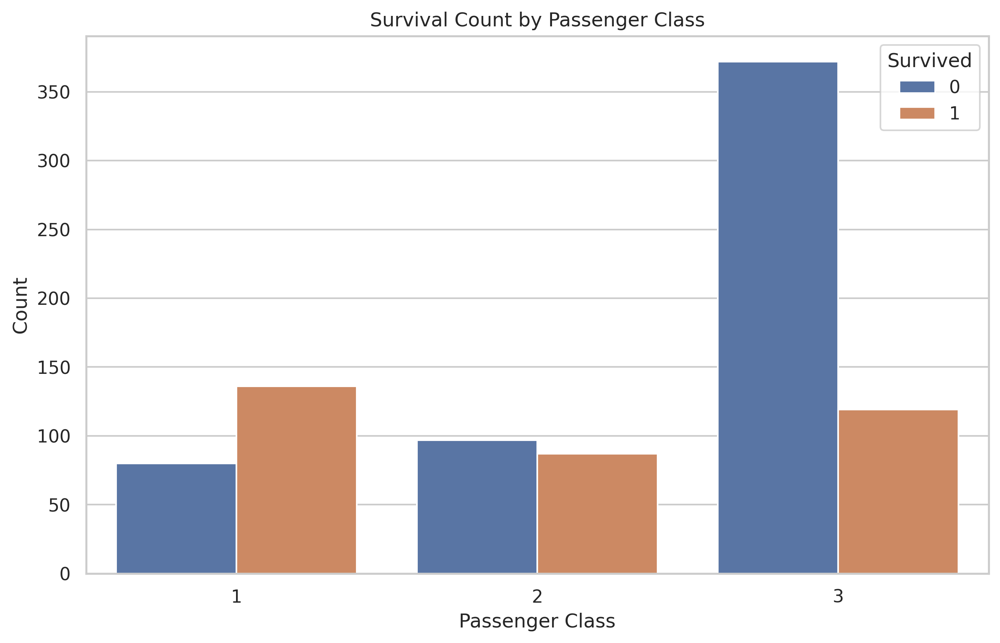
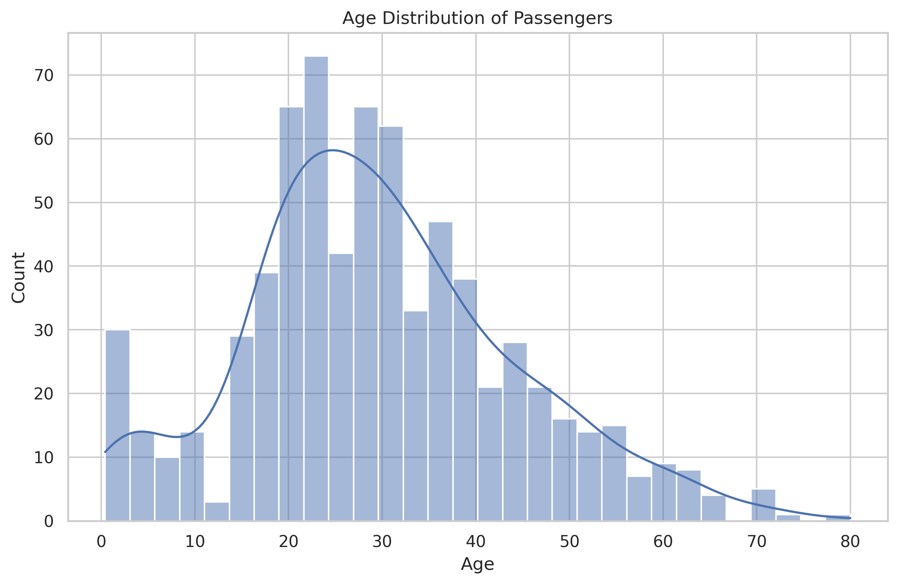
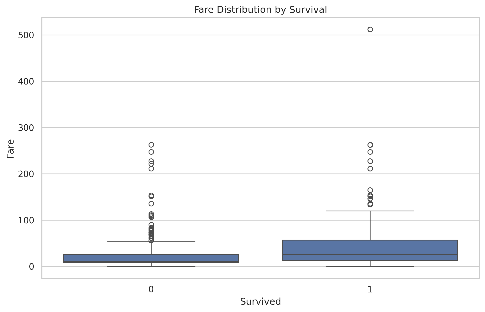
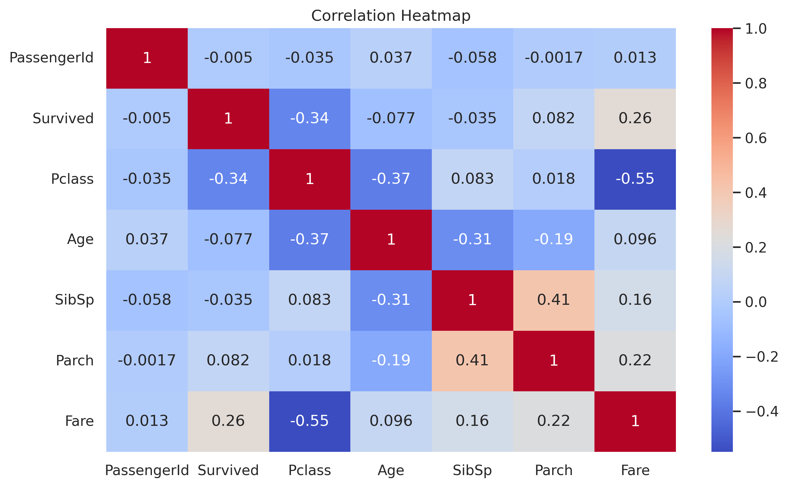
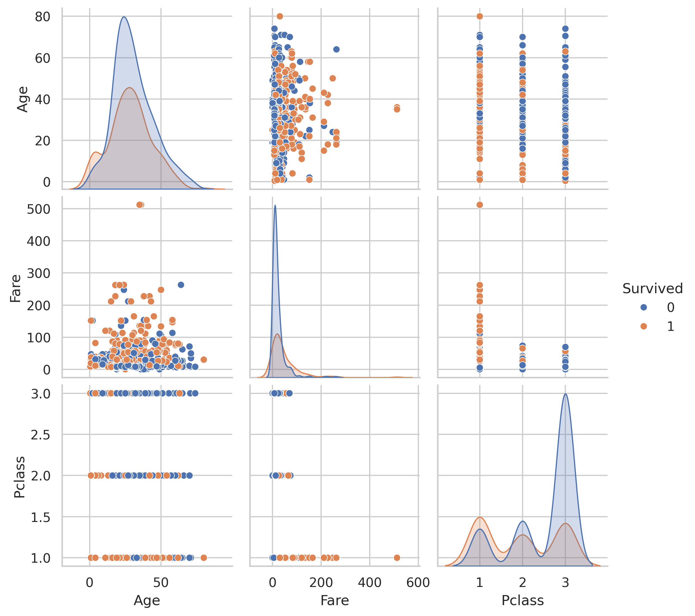

<h1 align="center">Task 05 – Exploratory Data Analysis (EDA)</h1>

<p align="center">
  <a href="https://www.python.org/">
    
  </a>
  <a href="https://jupyter.org/">
    
  </a>
  <a href="#task-status">
    
  </a>
</p>

---

## Overview
This task performs **Exploratory Data Analysis (EDA)** on the Titanic passenger dataset to
identify patterns, trends, and relationships that influenced survival outcomes.
The project follows a **clean, reproducible, and industry-aligned structure** suitable
for internship evaluation and portfolio review.

---

## Objectives
- Inspect dataset structure and data quality
- Analyze missing values and distributions
- Explore survival patterns across gender, class, age, and fare
- Visualize relationships using statistical and graphical techniques
- Document insights clearly with reproducible outputs

---
## Dataset

This task uses the well-known **Titanic Passenger Dataset**, containing demographic
and socio-economic information used to analyze survival outcomes.

### Data Files Included

- **Raw Dataset**
  - Original, unmodified passenger data
  - Preserved for reproducibility and reference

- **Processed Dataset**
  - Cleaned version of the raw data
  - Used during analysis after handling missing values
  - Provided for reuse in downstream tasks or modeling

### Dataset Files

[](data/raw/titanic.csv)
[](data/processed/titanic_cleaned.csv)


---

## Project Structure
```text
Task-05_Exploratory-Data-Analysis-EDA/
├── README.md
├── data/
│   ├── processed/
│   │   └── titanic_cleaned.csv
│   └── raw/
│       └── titanic.csv
├── notebooks/
│   └── 01_titanic_eda.ipynb
├── outputs/
│   ├── figures/
│   │   ├── age_distribution.png
│   │   ├── correlation_heatmap.png
│   │   ├── fare_distribution.png
│   │   ├── pairplot.png
│   │   ├── survival_by_class.png
│   │   └── survival_by_gender.png
│   └── observations/
│       └── eda_observations.md
├── reports/
│   └── Task-05_Titanic_EDA_Report.pdf
└── requirements.txt
```

---

## Tools and Technologies

* **Language**: Python
* **Libraries**: Pandas, NumPy, Matplotlib, Seaborn
* **Environment**: Python Virtual Environment (venv)
* **IDE**: VS Code / Jupyter Notebook

---

## Analysis Highlights

### Survival by Gender


### Survival by Passenger Class



### Age Distribution



### Fare Distribution by Survival



### Correlation Heatmap



### Pairwise Relationships



---

## Key Insights

* Female passengers had significantly higher survival rates
* First-class passengers were more likely to survive
* Higher fares correlated with higher survival probability
* Age showed weaker correlation compared to class and gender
* Survival outcomes were influenced by multiple interacting factors

---

## Installation and Setup

### Prerequisites

* Python **3.9 or later**
* Git
* VS Code or Jupyter-compatible IDE

---

### Step 1: Clone Repository

```bash
git clone https://github.com/atharmshaikh/data-analyst-internship-tasks.git
cd data-analyst-internship-tasks/Task-05_Exploratory-Data-Analysis-EDA
```

---

### Step 2: Create Virtual Environment

#### Linux / macOS

```bash
python3 -m venv .venv
source .venv/bin/activate
```

#### Windows (PowerShell)

```powershell
python -m venv .venv
.venv\Scripts\Activate.ps1
```

---

### Step 3: Install Dependencies

```bash
pip install -r requirements.txt
```

---

## Running the Project

### Option 1: Jupyter Notebook

```bash
jupyter notebook notebooks/01_titanic_eda.ipynb
```

### Option 2: VS Code

* Open the task folder in VS Code
* Select the Python interpreter from `.venv`
* Open `01_titanic_eda.ipynb`
* Run cells sequentially from top to bottom

---

## Outputs

* **Figures**: `outputs/figures/`
* **Written Observations**: `outputs/observations/eda_observations.md`
* **Final PDF Report**: `reports/Task-05_Titanic_EDA_Report.pdf`
* **Cleaned Dataset**: `data/processed/titanic_cleaned.csv`

---

## Reproducibility

* Analysis can be fully reproduced using the raw dataset and notebook
* Cleaned dataset is provided for reuse
* No external credentials or proprietary tools required

---

## Author

**Athar Shaikh**
Data Analyst Intern
Athar Shaikh  
Elevate Labs