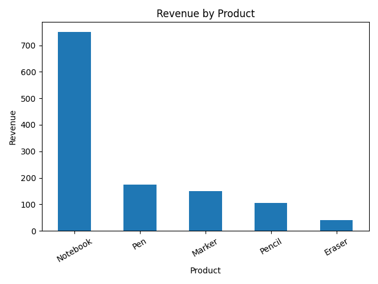

# Task 07 — Basic Sales Summary Using SQLite & Python

<p align="left">
    
    
    
    
    
</p>

---

## Overview

This task demonstrates how to generate a **basic sales summary** from a lightweight SQLite database using **SQL executed within Python**.
The analysis aggregates **product-level sales quantity and revenue** and visualizes revenue distribution using a simple bar chart.

The task is intentionally scoped to reflect **entry-level industry analytics work**, focusing on:

* correct SQL aggregation logic
* clean Python–database integration
* reproducible execution via virtual environments
* separation of analysis logic, presentation, and outputs
* disciplined version-control practices

---

## Objective

* Create and manage a small SQLite database
* Execute SQL aggregation queries via Python
* Compute product-level total quantity sold
* Compute product-level total revenue
* Visualize revenue distribution using a bar chart

---

## Dataset Description

**Database File:** `sales_data.db`

**Table Name:** `sales`

| Column Name | Type    | Description         |
| ----------- | ------- | ------------------- |
| `product`   | TEXT    | Name of the product |
| `quantity`  | INTEGER | Units sold          |
| `price`     | REAL    | Price per unit      |

The table design is intentionally minimal to focus on aggregation logic
rather than schema complexity.


### Data Lifecycle

1. The database file is **created manually** using **SQLite DB Browser**
2. The `sales` table schema is defined
3. Sample records are inserted
4. The database is **saved and overwritten** after each modification
5. Python scripts **only read from the database** and do not mutate schema or data

This mirrors real-world workflows where analysts consume **pre-prepared data sources**.

---

## Tools & Technologies

* **Python 3.x**
* **SQLite** (embedded database)
* **Pandas** — data handling and tabular output
* **Matplotlib** — basic visualization
* **SQLite DB Browser** — database creation and inspection
* **VS Code** — development and notebook execution
* **Git & GitHub** — version control and collaboration

---

## Project Structure

```
Task-07_Basic-Sales-Summary-SQLite-Python/
├── data/
│   └── sales_data.db
├── notebooks/
│   └── sales_summary.ipynb
├── outputs/
│   └── sales_chart.png
├── src/
│   └── sales_summary.py
├── requirements.txt
└── README.md
```

### Structure Rationale

* **data/** — source database (read-only during analysis)
* **notebooks/** — presentation-focused walkthrough
* **outputs/** — generated visual artifacts
* **src/** — reusable and testable analysis logic
* **requirements.txt** — reproducible Python environment
* **README.md** — task documentation

This structure aligns with **industry analytics repositories** and supports maintainability.

---

## Analysis Performed

### Sales Aggregation

The core SQL query computes:

* total quantity sold per product
* total revenue per product

```sql
SELECT
    product,
    SUM(quantity) AS total_qty,
    SUM(quantity * price) AS revenue
FROM sales
GROUP BY product
ORDER BY revenue DESC;
```

### Visualization

* Revenue is visualized using a **bar chart**
* Products are sorted by revenue (descending)
* The chart is generated programmatically and saved as:

  ```
  outputs/sales_chart.png
  ```

---

## How to Run the Analysis

**All commands below assume execution from the Task-07 project directory.**

### 1️⃣ Create & Activate Virtual Environment

#### Linux / macOS

```bash
python3 -m venv venv
source venv/bin/activate
```

#### Windows (PowerShell)

```powershell
python -m venv venv
venv\Scripts\Activate.ps1
```

---

### 2️⃣ Install Dependencies

```bash
pip install -r requirements.txt
```

---

### 3️⃣ Run the Analysis Script

```bash
python src/sales_summary.py
```

This will:

* print the aggregated sales summary to the console
* generate `outputs/sales_chart.png`

---

## Running the Notebook (Optional)

The notebook acts as a **presentation layer** and does not duplicate logic.

### Instructions

1. Open `notebooks/sales_summary.ipynb` in **VS Code**
2. Select the Python kernel pointing to:

   ```
   Task-07_Basic-Sales-Summary-SQLite-Python/venv/bin/python
   ```
   (On Windows, select the corresponding interpreter under `venv\Scripts\python.exe`.)
3. Run cells sequentially

The notebook reuses functions from `src/sales_summary.py`.

---

## Output Preview

The revenue visualization generated by the analysis can be accessed here:

<a href="outputs/sales_chart.png" target="_blank">
  
</a>

The chart is generated programmatically using Matplotlib and saved to the
`outputs/` directory for reference and review.

---

## Key Metrics

* **Total Quantity Sold (per product)**
* **Total Revenue (per product)**

These metrics are foundational in sales reporting and inventory analysis.

---

## Learning Outcomes

* Writing SQL aggregation queries
* Integrating SQLite with Python
* Loading SQL results into Pandas
* Generating visual outputs programmatically
* Structuring analytics tasks using industry-aligned practices
* Managing dependencies with virtual environments
* Applying disciplined Git workflows

---

## Repository Context

This task is part of a **unified Data Analyst Internship repository**, where all internship tasks are consolidated and refactored to follow:

* clean repository structure
* professional documentation standards
* incremental and auditable Git history

---

## Author

**Athar Shaikh**

Data Analyst Intern  
Elevate Labs  