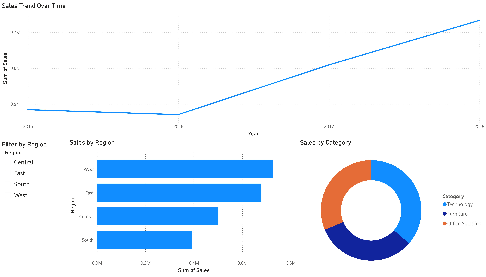

# Task 08 — Interactive Sales Dashboard (Superstore Dataset)

<p align="left">
    
    
    
    
</p>

---

## Overview

This task focuses on designing a **simple, interactive sales dashboard** to analyze
sales performance across **time, regions, and product categories** using Power BI.

The objective is to demonstrate the ability to:

* translate raw tabular data into clear business visuals
* apply correct aggregation logic
* design dashboards that are readable, focused, and stakeholder-friendly

The task intentionally avoids advanced modeling or automation and instead emphasizes
**clarity, correctness, and presentation quality**, which are essential skills for
entry-level data analysts.

---

## Objective

* Build a clean interactive dashboard using a real-world sales dataset
* Analyze sales performance by:

  * time (trend analysis)
  * region
  * product category
* Enable basic interactivity using slicers
* Summarize insights in clear, business-oriented language

---

## Dataset Description

**Dataset:** `Superstore_Sales.csv` (Superstore sample dataset)

The dataset represents transactional sales data from a retail superstore.

Key columns used in this task:

| Column Name  | Description                            |
| ------------ | -------------------------------------- |
| `Order Date` | Date when the order was placed         |
| `Region`     | Sales region                           |
| `Category`   | Product category                       |
| `Sales`      | Revenue generated from the order       |
| `Profit`     | Profit from the order (not visualized) |

Additional columns are present in the dataset but were intentionally excluded
to keep the dashboard focused and uncluttered.

### Dataset Source

The Superstore dataset used in this task is a publicly available sample dataset
commonly used for educational and demonstration purposes in analytics and
business intelligence tools.

---

## Tools & Technologies

* **Power BI Desktop** — dashboard creation and interactivity
* **Superstore Sales Dataset** — source data
* **Git & GitHub** — version control and task consolidation

No external data cleaning or scripting pipelines were used for this task.

This task focuses exclusively on dashboard design and visual analysis;
no external scripting or data preprocessing pipelines were used.

---

## Project Structure

```
Task-08_Interactive-Sales-Dashboard-Superstore/
├── data/
│   └── Superstore_Sales.csv
├── dashboard/
│   ├── sales_dashboard.pbix
│   └── dashboard_preview.jpg
├── insights/
│   └── insights.md
└── README.md
```

### Structure Rationale

* **data/** — raw dataset used for analysis
* **dashboard/** — Power BI source file and visual preview
* **insights/** — written business insights derived from the dashboard
* **README.md** — task documentation

This layout mirrors common analytics project repositories and supports
clarity and maintainability.

---

## Dashboard Components

### 1️⃣ Sales Trend Over Time

* Line chart showing total sales progression over time
* Helps identify overall sales trends and growth patterns over time

### 2️⃣ Sales by Region

* Bar chart comparing total sales across regions
* Enables quick identification of top- and low-performing regions

### 3️⃣ Sales by Category

* Donut chart illustrating contribution of each product category
* Highlights category-level revenue distribution

### 4️⃣ Interactive Filter

* Region slicer enabling dynamic filtering across all visuals
* Enhances user-driven exploration of the data

---

## Dashboard Preview

The final dashboard layout is shown below:

<a href="dashboard/dashboard_preview.jpg" target="_blank">
  
</a>

---

## Key Insights

Business insights derived from the dashboard are documented separately:

📄 **[View Insights](insights/insights.md)**

The insights focus on:

* regional performance differences
* overall sales trends
* category-level revenue contribution

---

## How to Use

1. Open the Power BI file:

   ```
   dashboard/sales_dashboard.pbix
   ```
2. Ensure the dataset path points to:

   ```
   data/Superstore_Sales.csv
   ```
3. Interact with the slicer to filter visuals by region
4. Review insights alongside visual trends

---

## Learning Outcomes

* Designing clean, stakeholder-friendly dashboards
* Applying correct aggregation logic in BI tools
* Creating interactive visuals using slicers
* Translating visual patterns into written business insights
* Structuring BI projects using industry-aligned practices

---

## Repository Context

This task is part of a **unified Data Analyst Internship repository**, where all
internship tasks are consolidated and refactored to follow:

* professional repository structure
* clean documentation standards
* reproducible and review-friendly workflows

Earlier standalone implementations are archived to preserve a **single source of truth**.

---

## Author

**Athar Shaikh**
Data Analyst Intern  
Elevate Labs  